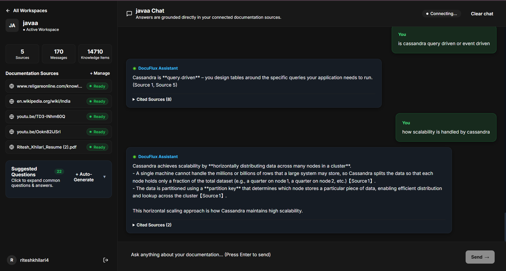
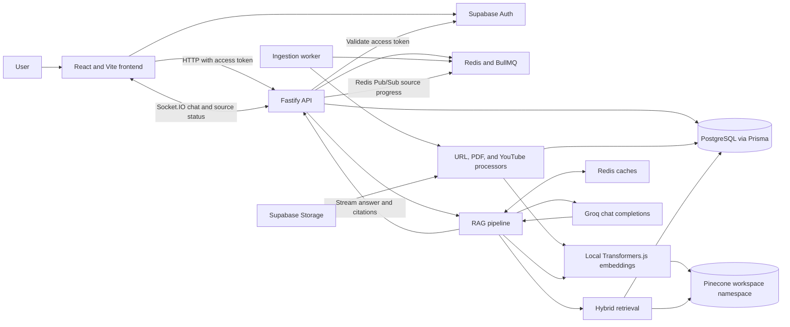
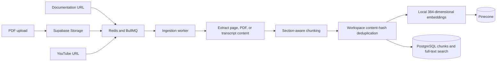

# DocuFlux

DocuFlux indexes documentation websites, PDFs, and YouTube videos into isolated workspaces, then answers questions using hybrid retrieval and citations from those sources. It is intended to make large or distributed documentation sets easier to query without losing the link back to the material behind an answer.


[GitHub repository](https://github.com/Technoritesh152005/RAG) · No live demo URL is documented in the repository.

## Screenshots

The repository includes one workspace chat screenshot. The landing page and evaluation screenshots below are placeholders; add those image files before relying on the links.




## Key features

- Organize documentation sources and chat history by workspace.
- Ingest documentation URLs, PDFs up to 25 MB, and supported YouTube video URLs.
- Process ingestion asynchronously through BullMQ workers, with source progress relayed through Redis Pub/Sub and Socket.IO.
- Extract and section-split content into parent/child chunks; deduplicate chunk content within a workspace before embedding.
- Generate 384-dimensional embeddings locally with Transformers.js and `Xenova/all-MiniLM-L6-v2`.
- Combine Pinecone vector search with PostgreSQL full-text search using reciprocal rank fusion (RRF), then apply adaptive Top-K selection.
- Stream grounded answers with source citations over Socket.IO.
- Cache embeddings, semantically similar answers, and contradiction-check results in Redis.
- Compare evaluation runs using retrieval, text-overlap, semantic, answer-quality, and latency metrics.
- Generate workspace FAQs from chat activity.

## Architecture

The API validates Supabase access tokens and scopes workspace operations to the authenticated user. The chat pipeline, ingestion worker, and persistence layers are shown below; there is no separate retrieval-result cache.



Ingestion and indexing flow:



## RAG pipeline

On a chat request, the backend:

1. Looks up the exact question embedding in the workspace-scoped Redis embedding cache; on a miss it generates an embedding locally and attempts to cache it.
2. Checks the semantic answer cache using the question embedding. A qualifying cache hit returns the saved answer and citations without running retrieval or generation.
3. On a miss, searches Pinecone and PostgreSQL full-text search in parallel. Pinecone vectors are queried in the workspace namespace; keyword search uses PostgreSQL text-search ranking.
4. Merges candidates with reciprocal rank fusion and selects a result set using adaptive Top-K logic. A low-confidence or empty result set returns a fallback response.
5. For confident results from at least two distinct sources, checks for contradictions. A cached result may avoid repeating this check.
6. Builds a prompt from the retrieved context and streams the Groq response, citations, and metadata to the client over Socket.IO.
7. Stores the completed answer, citations, and contradiction result in the semantic answer cache when caching is enabled.

## Caching architecture

| Layer | Purpose | Lookup method | Stored value | Hit behavior | Invalidation / TTL |
|---|---|---|---|---|---|
| Embedding cache | Avoid recomputing an exact question embedding | SHA-256 of the normalized question, scoped by workspace | Encoded embedding vector | Reuses the vector; retrieval still runs unless the semantic answer cache also hits | 24-hour TTL; workspace cache invalidation removes matching keys |
| Semantic answer cache | Reuse answers for sufficiently similar questions | Compare the question embedding against cached vectors in the workspace; similarity threshold is 0.9 | Question embedding plus answer, citations, and contradiction data in separate Redis hashes | Returns the saved response and skips retrieval, contradiction detection, and generation | 24-hour TTL; capped at 100 entries per workspace with least-recently-used eviction; invalidated after source changes or through the workspace cache endpoint |
| Contradiction cache | Avoid repeating a contradiction check for the same question and retrieved chunks | Workspace-scoped hash of the sorted retrieved chunk IDs; the question hash is incorporated into those IDs | A contradiction object or JSON `null` for a checked result with no contradiction | Reuses the saved result; `null` is a valid cache hit meaning no contradiction was found | 24-hour TTL; workspace cache invalidation removes matching keys |

There is no retrieval-result cache. The contradiction cache runs after retrieval, so a hit avoids another contradiction check but does not avoid vector or keyword search.

## Contradiction detection

Contradiction detection runs after confident retrieval when the returned chunks represent at least two distinct sources. The detector asks the Groq chat model whether the retrieved content makes conflicting claims relevant to the current question; it records both claims and their source details without choosing which source is correct.

The cache key includes both the question and the retrieved chunk set, scoped to the workspace. A cached JSON `null` is treated as a successful “no contradiction” result, so the detector is not called again for the same key. Retrieval itself is still performed before this cache can be checked.

## Tech stack

| Category | Technology | Purpose |
|---|---|---|
| Frontend | React 19, Vite | Workspace UI, chat, source management, and evaluation screens |
| Backend | Node.js, Fastify | HTTP API and application services |
| Authentication | Supabase Auth | Email/password and Google OAuth sign-in; backend access-token verification |
| Database | PostgreSQL, Prisma | Workspaces, sources, messages, chunks, usage, and evaluation records |
| Vector search | Pinecone | Workspace-namespaced vector storage and similarity search |
| Keyword search | PostgreSQL full-text search | Text matching and ranking over stored chunks |
| Cache and queue | Redis, ioredis, BullMQ | Cache entries, ingestion queues, and source-status Pub/Sub |
| LLM | Groq API | Streaming answers, FAQ generation, and contradiction checks |
| Embeddings | Hugging Face Transformers.js | Local `Xenova/all-MiniLM-L6-v2` embeddings |
| Web ingestion | Crawlee, Mozilla Readability | Same-site crawling and readable page extraction |
| PDF storage and parsing | Supabase Storage, PDF.js | Signed PDF uploads, storage, and text extraction |
| YouTube ingestion | `youtube-transcript`, `@distube/ytdl-core`, FFmpeg | Transcript ingestion with an audio transcription fallback |

## Project structure

```text
RAG/
├── Backend/
│   ├── prisma/                 # Prisma schema and database migrations
│   └── src/
│       ├── lib/                # Prisma, Redis, Pinecone, and Supabase clients
│       ├── modules/            # API, chat/RAG, cache, ingestion, and evaluation
│       ├── worker/             # Ingestion and source-cleanup BullMQ workers
│       └── server.js           # Fastify and Socket.IO server
├── Frontend/
│   ├── public/                 # Static assets, including the workspace screenshot
│   └── src/
│       ├── api/                # HTTP API clients
│       ├── auth/               # Supabase authentication
│       ├── features/           # Chat, sources, evaluation, and FAQs
│       ├── pages/              # Application pages
│       └── realtime/           # Socket.IO integration
└── docker-compose.yml          # Local Redis service only
```

## Getting started

### Prerequisites

- Node.js and npm.
- Docker with the Docker Compose plugin, for local Redis.
- A PostgreSQL database.
- Supabase project credentials. Create the `pdf-bucket-sources` Storage bucket if PDF ingestion is needed.
- A Pinecone index with a vector dimension of `384`.
- A Groq API key.

The repository does not include an `.env.example`; configure the variables listed below in `Backend/.env` and `Frontend/.env`. The Compose file starts Redis only; it does not provision PostgreSQL or the external Supabase, Pinecone, or Groq services.

### Run Redis

From the repository root:

```sh
docker compose up -d redis
```

### Configure and run the backend

Create `Backend/.env` with the required backend settings from the environment table. Then:

```sh
cd Backend
npm install
npx prisma generate
npx prisma migrate deploy
npm start
```

Run the worker in a separate terminal, also from `Backend/`:

```sh
npm run worker
```

### Configure and run the frontend

Create `Frontend/.env` with the frontend settings from the environment table. In another terminal:

```sh
cd Frontend
npm install
npm run dev
```

The API defaults to port `4000` and the Vite development server defaults to port `5173`. Configure Google OAuth in the Supabase project and its redirect allow-list before using Google sign-in.

## Environment variables

No secret values are included here. Backend values belong in `Backend/.env`; frontend values belong in `Frontend/.env`. Supabase service-role credentials must remain backend-only.

| Variable | Required | Purpose |
|---|---|---|
| `DATABASE_URL` | Yes | PostgreSQL connection string used by Prisma |
| `REDIS_URL` | Yes | Redis connection used by the API and workers |
| `SUPABASE_URL` | Yes | Supabase project URL used by backend auth and PDF storage |
| `SUPABASE_ANON_KEY` | Yes | Backend Supabase client key used to verify access tokens |
| `SUPABASE_SERVICE_KEY` | For PDF storage | Backend service-role key used for signed uploads and private PDF storage |
| `PINECONE_API_KEY` | Yes | Pinecone API credential |
| `PINECONE_INDEX` | Yes | Pinecone index name |
| `GROQ_API_KEY` | Yes | Groq API credential |
| `GROQ_MODEL` | No | Groq model override; defaults to `openai/gpt-oss-20b` |
| `PORT` | No | Backend HTTP port; defaults to `4000` |
| `FRONTEND_VITE_URL` or `FRONTEND_URL` | No | Allowed frontend origin for CORS; defaults to `http://localhost:5173` |
| `NODE_ENV` | No | Runtime mode; controls whether the local auth bypass can be enabled |
| `LOCAL_AUTH_BYPASS` | No; development only | Enables the local-user bypass only when `NODE_ENV` is not `production` |
| `LOCAL_USER_ID` | No; development only | User ID used with the local auth bypass; defaults to `local-dev-user` |
| `VITE_API_URL` | No | Frontend API and Socket.IO base URL; defaults to `http://localhost:4000` |
| `VITE_SUPABASE_URL` | Yes, frontend | Supabase project URL used by the browser auth client |
| `VITE_SUPABASE_ANON_KEY` | Yes, frontend | Supabase public anon key used by the browser auth client |

## Database and ingestion

Each workspace owns its sources, messages, chunks, and evaluation data. URL sources are crawled on the same host and within the source path prefix, with a maximum of 100 requests per crawl. Readability extracts page content, which is split into section-aware parent and child chunks. PDF pages use PDF.js extraction and the shared chunking logic. YouTube ingestion uses available captions and can fall back to audio transcription.

BullMQ workers process ingestion jobs and generate local embeddings. Workspace-level content hashes avoid re-embedding already-known chunk text. Chunk text and full-text-search fields are stored in PostgreSQL; vectors and retrieval metadata are stored in Pinecone under the workspace namespace. PDFs are held in Supabase Storage. Source status is sent from the worker to the API over Redis Pub/Sub and then to clients over Socket.IO.

## API overview

HTTP API routes, other than `/health`, use Supabase bearer-token authentication. The chat and source-status streams use Socket.IO.

| Method | Endpoint | Purpose |
|---|---|---|
| `GET`, `POST` | `/api/workspace/` | List or create workspaces |
| `GET`, `PATCH`, `DELETE` | `/api/workspace/:id` | Read, update, or delete a workspace |
| `GET` | `/api/workspace/:id/stats` | Workspace counts and statistics |
| `DELETE` | `/api/workspace/:id/cache` | Invalidate that workspace's Redis caches |
| `GET`, `POST` | `/api/workspaces/:workspaceId/sources` | List or add a URL/YouTube source |
| `POST` | `/api/workspaces/:workspaceId/sources/:sourceId/reindex` | Re-index a source |
| `DELETE` | `/api/workspaces/:workspaceId/sources/:sourceId` | Delete a source |
| `POST` | `/api/workspaces/:workspaceId/sources/pdf/init-upload` | Request a signed PDF upload URL |
| `POST` | `/api/workspaces/:workspaceId/sources/pdf/:sourceId/confirm-upload` | Confirm upload and enqueue PDF ingestion |
| `GET`, `DELETE` | `/api/workspaces/:workspaceId/messages` | Read or clear chat history |
| `GET`, `POST` | `/api/workspaces/:workspaceId/faqs` and `/faqs/generate` | Read or generate workspace FAQs |
| `POST` | `/api/workspaces/:workspaceId/eval/cases` | Create an evaluation case |
| `GET`, `DELETE` | `/api/workspaces/:workspaceId/eval/cases` | List or clear evaluation cases |
| `DELETE` | `/api/workspaces/:workspaceId/eval/cases/:caseId` | Delete an evaluation case |
| `POST` | `/api/workspaces/:workspaceId/eval/run` | Run evaluation cases |
| `GET` | `/api/workspaces/:workspaceId/eval/runs` and `/eval/runs/:runId` | List runs or read a run and its results |
| `GET` | `/api/workspaces/:workspaceId/usage` and `/getCacheStats` | Read usage or cache statistics |
| `GET` | `/health` | Check PostgreSQL, Redis, and Pinecone connectivity |

Chat Socket.IO events include `workspace:join`, `chat:message`, `chat:start`, `chat:metadata`, `chat:token`, `chat:done`, `chat:error`, and history events.

## Evaluation and performance

Evaluation cases can include expected source URLs, graded source relevance, expected key facts, and an optional reference answer. Each run records retrieval hit rate, MRR, confidence rate, average and P95 latency, and the available per-case metrics:

- Retrieval: Precision@K, Recall@K, F1@K, and nDCG@K.
- Reference-answer comparison: BLEU-4, ROUGE-L, METEOR, and BERTScore.
- Generation and end-to-end quality: Perplexity, groundedness, hallucination rate, factual consistency, answer relevance, and an LLM judge score.

Some metrics depend on reference data or model log-probability support and may be unavailable for a case. Evaluation runs bypass the answer caches. No curated, validated benchmark results are published in this README; run the evaluation suite on your own workspace to obtain measurements for its sources and cases.

## Security and reliability

- Supabase validates backend bearer tokens; HTTP routes and chat requests check workspace ownership before operating on workspace data.
- Workspace IDs are used in Pinecone namespaces and Redis cache keys, and workspace relations are represented in PostgreSQL.
- Fastify rate limiting is enabled, with a separate limit configured for workspace routes; chat messages also have a per-connection rate limit.
- Ingestion and source-cleanup queues retry failed jobs with exponential backoff.
- Local auth bypass is disabled in production and should not be enabled for shared or deployed environments.

## Future improvements

- Add a committed environment template and documented local PostgreSQL setup.
- Add reproducible evaluation fixtures and publish benchmark results only after validating the test set and metric outputs.
- Add landing-page and evaluation screenshots to replace the marked placeholders.

## License

No license file is currently present in the repository. Add a `LICENSE` file before distributing or reusing the project.
